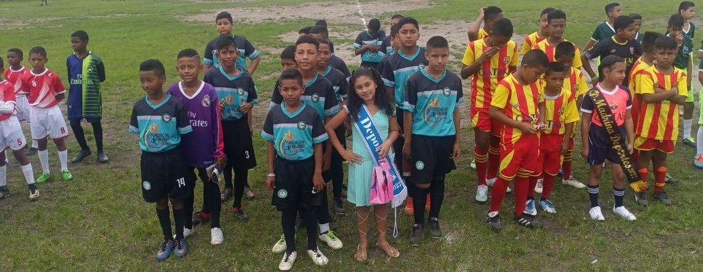

## Los sueños son posibles si los forjo todos los días

La Fundación Forjando Sueños en la Niñez y Adolescencia nace en enero de 2022 con el objetivo de brindar una alternativa a los niños, niñas y adolescentes de escasos recursos económicos y en estado de vulnerabilidad, para que, a través del deporte y educación, tengan nuevas oportunidades y puedan mejorar sus condiciones de vida.

La Fundación Forjando Sueños en la Niñez y Adolescencia es una organización social naciente, sin fines de lucro, apolítica y sin discriminación racial o religiosa. Todos los cargos directivos son ad honorem. El deporte es el lazo que nos une como familia.

Este bonito proyecto es posible gracias a los cofundadores, padrinos y madrinas que nos hacen llegar su granito de arena cada mes, con ello adquirimos implementos deportivos y damos una pequeña suma de dinero al profesor que entrena a los niños.

Con estudios y dedicando el tiempo libre al deporte es como nuestros campeones saldrán adelante. Por eso querido amigo y querida amiga, no sabríamos cómo agradecerte el apoyo que nos brindas, de todo corazón deseamos que Dios te siga bendiciendo siempre.

Un cordial saludo,

Econ. Carlos Zambrano

**PRESIDENTE PROVISIONAL**
